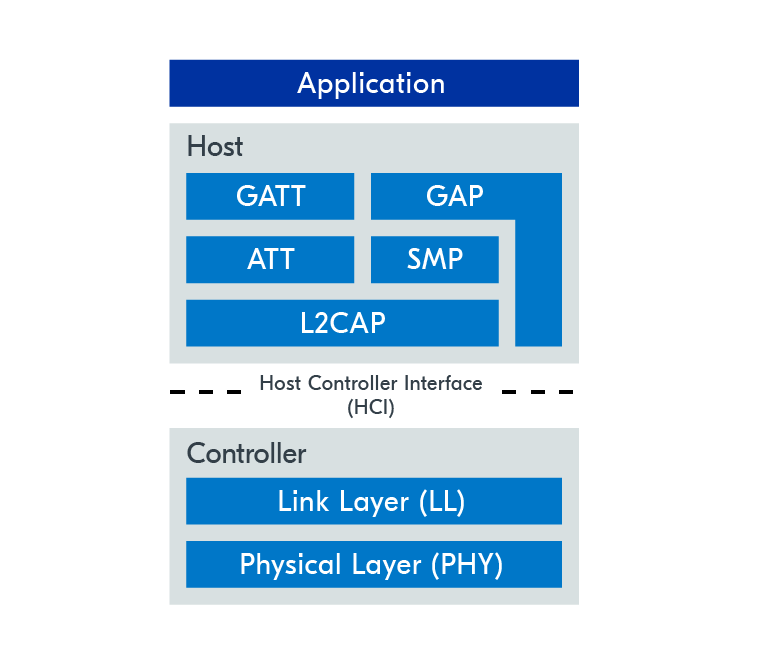
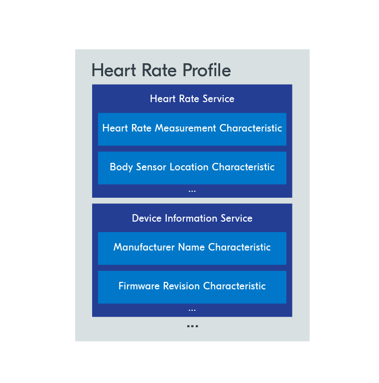
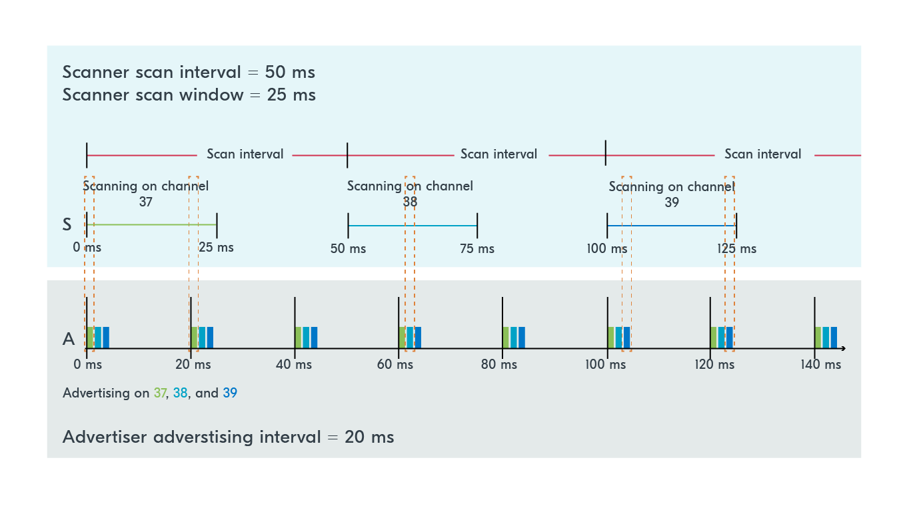

# Personal BLE notes

Notes are taken from [Nordic Semiconductors Academy course.](https://academy.nordicsemi.com/courses/bluetooth-low-energy-fundamentals/)

## Table of Contents

## Introduction

- Low energy achieved by sacrificing data rate
  - smaller packets, sent less frequent
- Operating band: 2400 MHz - 2483.5 Mhz (~2.4 MHz)

### BLE protocol Stack

- L2CAP - Logical Link Control & Adaptation Protocol
  - data encapsulation services for upper layers

- SMP - Security Management Protocol
  - provides methods for secure communication
  
- ATT - Attribute Layer
  - allows to expose certain pieces of data to another device

- GATT - Generic Attribute Layer
  - defines sub-procedures for ATT layer

- GAP - Generic Access Profile
  - interface with app to handle device discovery and communication related services

- Physical Layer
  - modulates data to radio waves

- Link Layer
  - manages radio state:
    - standby
    - advertising
    - scanning
    - initiating connection

### GAP - Device Roles and Topologies

2 communication styles:
- connection oriented: bi-directional, dedicated connection
- broadcast: devices communicate without establishing a connection

For connection:
- **Peripheral** - device is advertising (transmitting packets, either to broadcast data or to be discovered)
- **Central** - device is scanning (listening for advertising data)

No connection:
- **Broadcaster** - sends advertising packet, not receiving or allowing connection,
- **Observer** - listens to device packets, but doesn't send connection requests
- This has limited throughput by data in adv. packets

HUB - device that acts as peripheral (ie. connects to phone) **AND** central (ie. listening to sensors)

### ATT & GATT - Data representation and exchange

Phase after communication established

**GATT Server** - stores data and provides methods for GATT client to access it 
**GATT Client** - accesses dat aon GATT Server

> 📝 **IMPORTANT:** GATT Server/Client roles are independent from Peripheral/Central roles

**ATT** defines data structure (attribute). Server can hold many attributes.
Server can directly read data or client can poll for it.

**GATT** hierarchically classifies attributes into profiles, services, characteristics

TODO: ADD example here maybe?

### PHY - Radio modes

1M PHY - 1Mbps
- supported by all BLE devices
- communication starts with this mode, can request others
  
2M PHY - 2Mbps
- introduced in BLE v5.0
- (+) radio ON for less time -> lower consumption
- (-) decreases receiver sensitivity -> shorter range

Coded PHY
- (+) slower data range
- (-) longer range
- Coding schemes for error bit correction:
  - S=2: 2 symbols for 1 bit (500kbps)
  - S=8: 8 symbosl for 1 bit (125kbps)

## BLE Advertising

Interval 20 ms - 10.24 s, step 0.625 ms
Random 0 - 10 ms before each advertisement to prevent collisions

40 channels:
- 3 primary adv. channels - for advertising
- 37 secondary adv. channels - mainly for data transfer after connection
Packets sent on all 3 primary channels

Scanning:
- scan. interval: device scans for adv. packets
- scan. window: time device is scanning during each interval

Both range 2.5 ms - 10.25 ms, step 0.625 ms

> 📝 **IMPORTANT:** Tradeoff between power consumption and discovery time (usually scanning consumes more power)

Scan request - asking for additional info
Scan response - additional data transmitted on all 3 channels (can be declined)
    - can be used to send more data without establishing connection